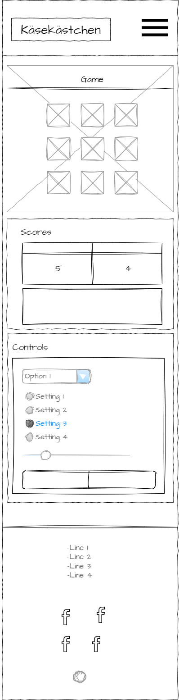
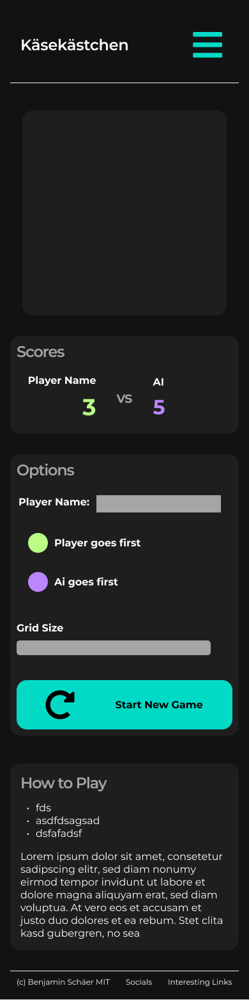
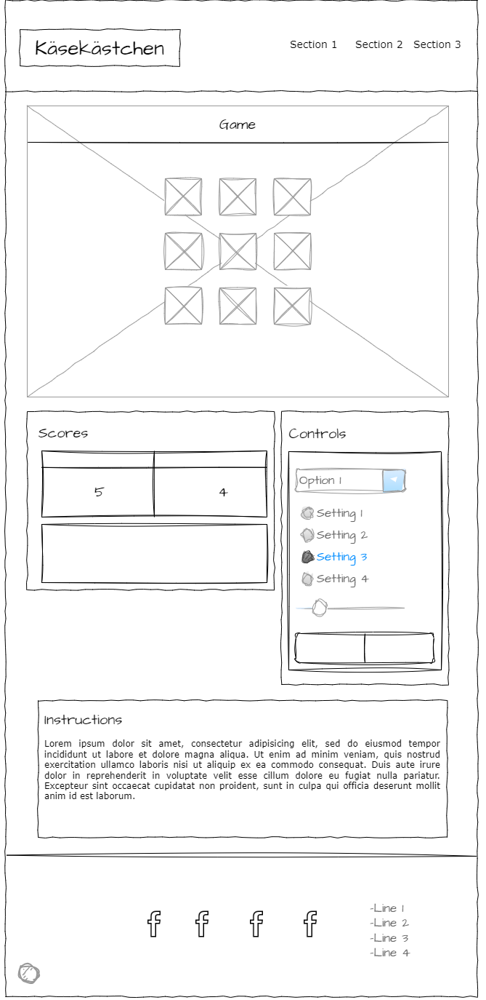
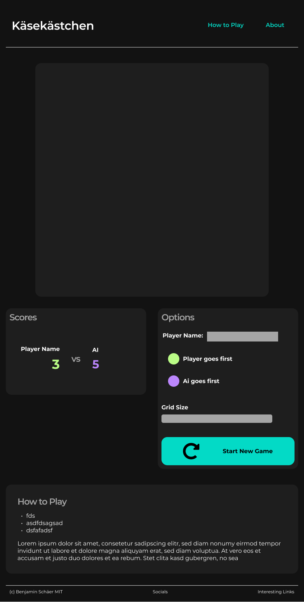
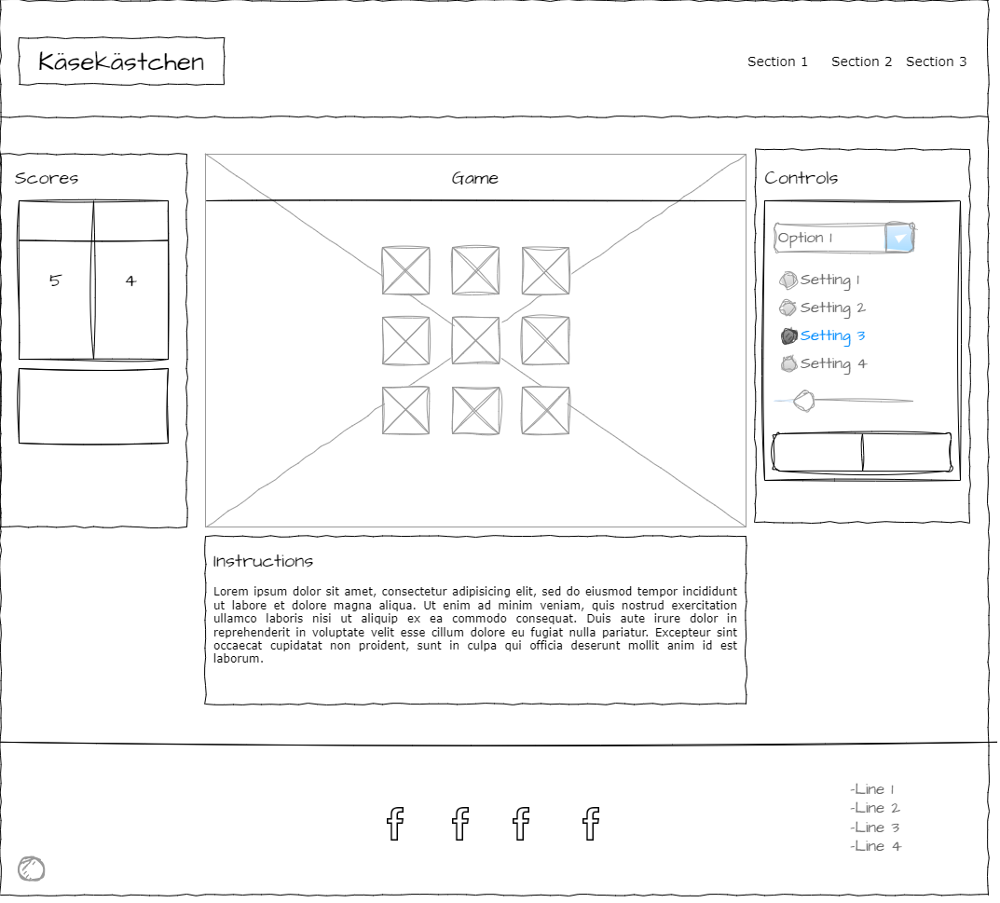
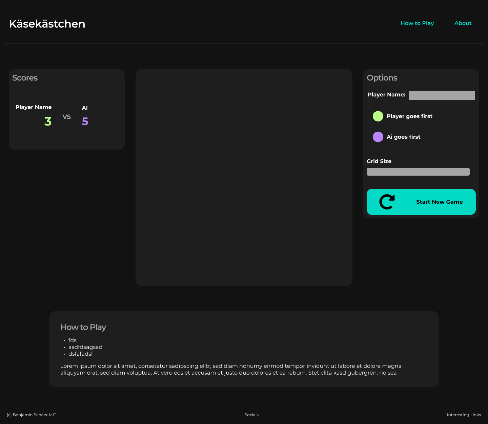

# Käsekästchen
## UX

### Colour Scheme

### Typography

## User Stories

|As a|I would like to|so that I can|
|----|----|----|

*Note: User stories that aren't in the scope of this version can be found under Future Features.*

## Wireframes / Mockups

| Device | Wireframe | Figma Mockup |
|-|-|-|
| Phone |  |  |
| Tablet |  |  |
| Desktop |  |  |

## Features

### Existing Features

### Future Features

#### Future User stories

#### Future Feature suggestions

## Tools & Technologies Used

## Testing
Code Validation and Testing can be found in a separate file called [TESTING.md](TESTING.md)

## Deployment

## Credits

### Content
| Source | Location | Notes |
| --- | --- | --- |

### Media
| Source | Location | filename | Notes |
| --- | --- | --- | --- |

### Acknowledgements
