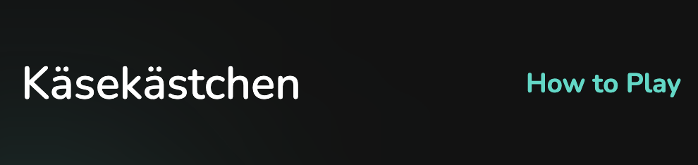

# [Käsekästchen](https://benschaf.github.io/kaesekaestchen)

Käsekästchen (German for: dots and boxes) is a web app that allows users to play the game of Käsekästchen online. The game is played on a grid of dots, where two players take turns drawing lines between the dots. The goal is to complete a square by drawing the fourth line around it. The player who completes the most squares wins the game.

[](https://github.com/benschaf/kaesekaestchen/deployments)
[](https://benschaf.github.io/kaesekaestchen/)
[](https://github.com/benschaf/kaesekaestchen/commits)
[](https://github.com/benschaf/kaesekaestchen/issues)
[](https://github.com/benschaf/kaesekaestchen/issues?q=is%3Aissue+is%3Aclosed)
[](https://github.com/benschaf/kaesekaestchen)
[](https://validator.nu/?doc=https%3A%2F%2Fbenschaf.github.io%2Fkaesekaestchen%2F)
[](https://jigsaw.w3.org/css-validator/validator?uri=https%3A%2F%2Fbenschaf.github.io%2Fkaesekaestchen%2Fassets%2Fcss%2Fstyle.css&profile=css3svg&usermedium=all&warning=1&vextwarning=&lang=en)

_Note: The Validation badges do not always load correctly. If the badge reads "inaccessible", please click on the badge to view the validation results._


## UX
### User Persona
The target audience for this web app is anyone who wants to play a fun and easy to learn game online. It's possible to play the game for 5 Minutes but if someone wants to play for longer, they can adjust the size of the grid to make the game more complex. The game is single player, so no second player is required. The game is also playable on mobile devices, so it can be played on the go (although a grid larger than 4x4 is not recommended on mobile devices).

### Colour Scheme
This web app is displayed in a dark theme. The colour scheme adheres to the [Material Design 2 Dark Theme guidelines](https://m2.material.io/design/color/dark-theme.html). This provides a familiar experience for users who are used to the dark theme on their devices. The dark theme also reduces eye strain which enables users to play the game for longer periods of time. The colours used are:

- `#121212` used for dark background
- `#1E1E1E` used for card background
- `#03DAC6` used for primary highlights
- `#FFFFFF` used for primary text
- `#A5A5A5` used for secondary text
- `#BAFC86` used for player colour
- `#BB86FC` used for AI colour

The player colour is a green colour, while the AI colour is a purple colour. These colours are used throughout the website to differentiate between the two players.

I've used CSS :root variables to easily update the global colour scheme by changing only one value, instead of everywhere in the CSS file:

```css
:root {
    /* p = Primary / s = Secondary */
    --dark-backgorund: #121212;
    --card-background: #1E1E1E;
    --p-highlight: #03DAC5;
    --p-highlight-transparent: rgba(3, 218, 197, 0.8);
    --p-text: #FFFFFF;
    --s-text: #A5A5A5;
    --player-color: #BAfC86;
    --ai-color: #BB86FC;
}
```
The `--p-highlight-transparent` variable is used for the hover effect on buttons.

I used the [coolors.co](https://coolors.co/) tool to visualize the colour scheme:


### Layout
The layout of the website also adheres to the [Material Design 2 Dark Theme guidelines](https://m2.material.io/design/color/dark-theme.html). The Layout is based on cards. The cards are used to group related content together. 

#### Information Architecture
The cards are also used to create a visual hierarchy.
- The biggest card is the **gameboard**, making it the main focus of the website. 
- The card on the top left is the **score card**, which is the second most important card. 
- The **options card** is the third most important card and always appears below or after the score card. 
- The **instructions card** is only visible upon scrolling down or clicking on the "How to Play" button in the header.

### Typography
- [Nunito](https://fonts.google.com/specimen/Nunito) was used for all text on the website. This font was chosen because of its playful roundness, which fits the theme and style of the game.
- [Font Awesome](https://fontawesome.com/) icons were used for the icons in the footer.

## User Stories

|As a|I would like to|so that I can|
|----|----|----|
|User|play a fun game|spend some time|
|User|play the game on different devices|play on my preferred device|
|User|select the size of the grid|customize the game to my liking|
|User|see the scores of both players|know who is winning|
|User|change my player name|personalize my game experience|
|User|choose who goes first in the game|strategize my game play|
|User|select the AI difficulty level|adjust the game to my skill level|
|User|adjust the size of the grid|control the complexity of the game|
|User|restart the game|play again|
|User|read the game instructions|understand how to play the game|

*Note: User stories that aren't in the scope of this version can be found under Future Features.*

## Wireframes / Mockups
The wireframes were created using [draw.io](https://www.drawio.com/). The mockups were created using [Figma](https://figma.com). The mockups were created after the wireframes to visualize the design of the website. The mockups were used as a reference during development.

Some of the design was finalized while implementing it in code. The final design differs slightly from the mockups. The final design can be found in the [Features](#features) section.

| Device | Wireframe | Figma Mockup |
|-|-|-|
| Phone |  |  |
| Tablet |  |  |
| Desktop |  |  |

## Features

### Existing Features

#### Logo and Heading
Featured at the top of the page, the Käsekästchen typography logo is easy to see for the user. Upon viewing the page, the user will be able to see the name of the game. The how to play button is displayed on the right side of the display. This button will scroll the user down to the instructions section.



#### Welcome Message
This section will allow the user to see a welcome message. The welcome message will give the user a brief introduction to the game and the website. The welcome message will also give the user a brief overview of the game instructions. This section was added after a user test revealed that the game instructions were not immediately visible to the user.


#### Gameboard
This section will allow the user to play the Käsekästchen game. The user will be able to easily see the grid of dots and draw lines between them by clicking on a disabled line. When a box is completed, the box will be automatically filled with the active players colour. Once all boxes are completed, the game will end and a message will be displayed to the user. A new game can then be started by clicking on the "Start New Game" button in the options area.


#### AI Opponent
The AI opponent is implemented in the game logic and will play against the user. The AI opponent will play a random move on the "Easy" difficulty level. The "Medium" difficulty follows an algorithm. Check it out in the code comments in the !!Link TO FILE!! file. The "Hard" difficulty is currently disabled and in development.

#### Turn indicator slider
At the bottom of the gameboard, a slider indicates whose turn it is. The slider is coloured after the active player's colour. The slider will move to the left when it's the player's turn and to the right when it's the AI's turn.


#### Score Card
This section will allow the user to see exactly how many squares they have completed and how many squares their opponent has completed, indicating who is winning. The Score Card will also display the name of the player and the difficulty level of the AI. Lastly it indicates whose turn it is by colouring the background of the active player's name and score.


#### Options Area
This section allows the user to customize their game experience. The options available are:

- ***Player Name:*** The user can input their desired name.
- ***Turn Choice:*** The user can choose who goes first - the player or the AI.
- ***AI Difficulty:*** The user can select the difficulty level of the AI. The options are "Easy", "Medium", and "Hard". Note that the "Hard" option is currently disabled and in development.
- ***Grid Size:*** The user can adjust the size of the grid using a range input. The minimum size is 2x2 and the maximum size is 8x8. The default size is 3x3.
- ***Start New Game:*** The user can start a new game by clicking on the "Start New Game" button.


#### Name Input Validation
If the users input for the player name is empty or only contains spaces, the displayed name will be set to the default name "Player". If the user inputs a string that is longer than 15 characters, a modal will be displayed to the user, informing them that the name is too long. The user can then input a new name.


#### Instructions
This section will allow the user to read the instructions on how to play the game. The user can click on the "How to Play" button in the header to scroll down to this section.


#### Footer
This section will allow the user to see copyright information. The footer also contains links to the developer's GitHub and LinkedIn profiles.


#### Background Blur Design elements
The background blur design elements are used to create a more interesting and playful design. The background blur elements are used behind the header and the footer. When the game is played, more backgorund blur elements are generated behind the gameboard. These elements are coloured after the player colours, depending on who completed which box. The slider indicator also has a corresponding background blur element.


#### Responsiveness
The website is fully responsive on all devices. This is acheived using media queries and CSS Grid and Flexbox for most of the layout. 

The gameboard is responsive using JavaScript. Each DOM element of the gameboard is individually created and resized depending on the size of the viewport. The gameboard is also responsive to the size of the grid. The grid size can be adjusted by the user in the options area. The gameboard will then be resized accordingly. Note that on mobile devices, a grid size larger than 4x4 is not recommended.


#### Single Page Application
The website is a single page application. This means that the user can play the game without having to reload the page. The user can also change the game settings without having to reload the page. This is achieved using JavaScript and DOM manipulation.

### Future Features

#### Proposed Future User stories
|As a|I would like to|so that I can|
|----|----|----|
|User|select the number of players|play against my friends|
|User|see the leaderboard|see who is the best player|
|User|play against a harder AI|challenge myself|
|User|display the game in a light theme|play in a light theme|

#### Proposed Future Features

**Multiplayer:** Allow users to play against each other online.

**Leaderboard:** Implement a leaderboard that shows the top players.

**Harder AI:** Implement a harder AI that can play against the user.

**Light Theme:** Implement a light theme for users who prefer a light theme.


## Tools & Technologies Used
- [JavaScript](https://en.wikipedia.org/wiki/JavaScript) used for the game logic and some of the responsive design
- [HTML](https://en.wikipedia.org/wiki/HTML) used for the main site content
- [CSS](https://en.wikipedia.org/wiki/CSS) used for the main site design and layout
- [CSS Flexbox](https://www.w3schools.com/css/css3_flexbox.asp) used for an enhanced responsive layout
- [CSS Grid](https://www.w3schools.com/css/css_grid.asp) used for an enhanced responsive layout
- [Git](https://git-scm.com/) used for version control (`git add`, `git commit`, `git push`)
- [GitHub](https://github.com/) used for secure online code storage
- [GitHub Pages](https://pages.github.com/) used for hosting the deployed front-end site
- [Github Issues](https://github.com/benschaf/kaesekaestchen/issues) used for issue tracking
- [GitHub Projects](https://github.com/users/benschaf/projects/3) used for project management in conjunction with GitHub Issues
- [Gitpod](https://gitpod.io/) used as a cloud-based IDE for development
- [Visual Studio Code](https://visualstudio.microsoft.com/de/#vscode-section) used a  local IDE for development
- [Google Chrome](https://www.google.com/chrome/) used as a browser for development
- [Google Chrome Developer Tools](https://developers.google.com/web/tools/chrome-devtools) used for testing and debugging
- [codepen.io](https://codepen.io/) used for the initial development of the game logic and proof of concept. See [the pen that startet it all](https://codepen.io/benschaf/pen/JjzKjWM)
- [draw.io](https://www.drawio.com/) used for wireframe creation
- [Figma](https://figma.com) used for design creation
- [Windows Snipping Tool](https://support.microsoft.com/de-de/windows/aufnehmen-von-screenshots-mithilfe-des-snipping-tools-00246869-1843-655f-f220-97299b865f6b) used to take screenshots and screencasts on Windows
- [grid.layoutit.com](https://grid.layoutit.com/) used to create the gameboard grid
- [Adobe free mp4 to gif converter](https://www.adobe.com/express/feature/video/convert/mp4-to-gif) used to convert screencasts to gif
- [shields.io](https://shields.io/) used to create the badges in the README.md file
- [autoprefixer](https://autoprefixer.github.io/) used to add vendor prefixes to css for browser compatibility

#### Special mention: Github Projects
Github Projects was an invaluable tool for project management. A screenshot of the project board can be found below:


## Testing
Code Validation and Testing can be found in a separate file called [TESTING.md](TESTING.md)

## Deployment
The site was deployed to GitHub Pages. The steps to deploy are as follows:

- In the [GitHub repository](https://github.com/benschaf/kaesekaestchen), navigate to the Settings tab 
- From the source section drop-down menu, select the **Main** Branch, then click "Save".
- The page will be automatically refreshed with a detailed ribbon display to indicate the successful deployment.

The live link can be found [here](https://benschaf.github.io/kaesekaestchen)

### Local Deployment

This project can be cloned or forked in order to make a local copy on your own system.

#### Cloning

You can clone the repository by following these steps:

1. Go to the [GitHub repository](https://github.com/benschaf/kaesekaestchen) 
2. Locate the Code button above the list of files and click it 
3. Select if you prefer to clone using HTTPS, SSH, or GitHub CLI and click the copy button to copy the URL to your clipboard
4. Open Git Bash or Terminal
5. Change the current working directory to the one where you want the cloned directory
6. In your IDE Terminal, type the following command to clone my repository:
	- `git clone https://github.com/benschaf/kaesekaestchen.git`
7. Press Enter to create your local clone.

Alternatively, if using Gitpod, you can click below to create your own workspace using this repository.

[](https://gitpod.io/#https://github.com/benschaf/kaesekaestchen)

Please note that in order to directly open the project in Gitpod, you need to have the browser extension installed.
A tutorial on how to do that can be found [here](https://www.gitpod.io/docs/configure/user-settings/browser-extension).

#### Forking

By forking the GitHub Repository, we make a copy of the original repository on our GitHub account to view and/or make changes without affecting the original owner's repository.
You can fork this repository by using the following steps:

1. Log in to GitHub and locate the [GitHub Repository](https://github.com/benschaf/kaesekaestchen)
2. At the top of the Repository (not top of page) just above the "Settings" Button on the menu, locate the "Fork" Button.
3. Once clicked, you should now have a copy of the original repository in your own GitHub account!

## Credits

### Content
To go to the source of the content, click on the link in the "Source" column.
To go to the relevant code inside this project, click on the link in the "Location" column.

| Source | Location | Notes |
| --- | --- | --- |
|[Wikipedia](https://en.wikipedia.org/wiki/Dots_and_Boxes) | [instructions card](https://github.com/benschaf/kaesekaestchen/blob/6250f858198af5fbe85397e82bb6e0b7602eee35/index.html#L98-L112) | used for game instructions |
|[Wikipedia](https://en.wikipedia.org/wiki/Dots_and_Boxes) | [computeLastTurn function](https://github.com/benschaf/kaesekaestchen/blob/6250f858198af5fbe85397e82bb6e0b7602eee35/assets/js/script.js#L271-L297) | used for game logic |
|[Favicon W3C](https://www.w3schools.com/html/html_favicon.asp) | [Favicon link](https://github.com/benschaf/kaesekaestchen/blob/6250f858198af5fbe85397e82bb6e0b7602eee35/index.html#L9) | used for favicon syntax |
|[CSS Blurred Background W3C](https://www.w3schools.com/howto/howto_css_blurred_background.asp) | [filter: blur(100px)](https://github.com/benschaf/kaesekaestchen/blob/6250f858198af5fbe85397e82bb6e0b7602eee35/assets/css/style.css#L85) and [function createBackgroundBlurElement()](https://github.com/benschaf/kaesekaestchen/blob/6250f858198af5fbe85397e82bb6e0b7602eee35/assets/js/script.js#L160-L181) | used for background blur syntax |
|[CSS :root Selector W3C](https://www.w3schools.com/cssref/sel_root.php) | [':root' selector](https://github.com/benschaf/kaesekaestchen/blob/6250f858198af5fbe85397e82bb6e0b7602eee35/assets/css/style.css#L9-L19) | used for CSS root syntax |
|[CSS Variables W3C](https://www.w3schools.com/css/css3_variables.asp) | [variables in ':root' selector](https://github.com/benschaf/kaesekaestchen/blob/6250f858198af5fbe85397e82bb6e0b7602eee35/assets/css/style.css#L9-L19) | used for CSS variables syntax |
|[developer.mozilla.org](https://developer.mozilla.org/en-US/docs/Web/CSS/box-sizing) | [box-sizing: border-box;](https://github.com/benschaf/kaesekaestchen/blob/6250f858198af5fbe85397e82bb6e0b7602eee35/assets/css/style.css#L57) | used for CSS box-sizing syntax |
|[mozilladevelopers.github.io](https://mozilladevelopers.github.io/playground/css-grid) | [game-area media query](https://github.com/benschaf/kaesekaestchen/blob/6250f858198af5fbe85397e82bb6e0b7602eee35/assets/css/style.css#L346-L368) | used for CSS grid syntax |
|[Medium Article by Martin Kearn](https://medium.com/@martink_rsa/js-docs-a-quickstart-guide-da6ce5df4a73) | [script.js](https://github.com/benschaf/kaesekaestchen/blob/6250f858198af5fbe85397e82bb6e0b7602eee35/assets/js/script.js) | used for JSDoc syntax |
|[Flexiple](https://flexiple.com/javascript/javascript-capitalize-first-letter) | [Difficulty indicator](https://github.com/benschaf/kaesekaestchen/blob/6250f858198af5fbe85397e82bb6e0b7602eee35/assets/js/script.js#L32-L33) | used for capitalizing the first letter of the difficulty string |
|[W3Schools](https://www.w3schools.com/js/js_arrow_function.asp) | [all arrow functions](https://github.com/benschaf/kaesekaestchen/blob/6250f858198af5fbe85397e82bb6e0b7602eee35/assets/js/script.js#L71-L79) | used for arrow function syntax |
|[Medium Article by Andrew Asmit](https://medium.com/@andrewasmit/passing-arguments-to-your-event-listeners-callback-function-d9d8369cc3a4) | [event handlers](https://github.com/benschaf/kaesekaestchen/blob/fb3a069e6e4100cee20b69043b7604c218d2b2e5/assets/js/script.js#L110-L126) | used for understanding anonymous functions (not used in current version) |
|[MDN Web Docs](https://developer.mozilla.org/en-US/docs/Web/API/Document_Object_Model/Introduction#dom_interfaces) | [JSDoc comments](https://github.com/benschaf/kaesekaestchen/blob/6250f858198af5fbe85397e82bb6e0b7602eee35/assets/js/script.js#L126) | used for understanding HTMLDivElement parameter and for using it in JSdoc comments in |
|[W3Schools](https://www.w3schools.com/jsref/met_win_settimeout.asp) | [setTimeout();](https://github.com/benschaf/kaesekaestchen/blob/6250f858198af5fbe85397e82bb6e0b7602eee35/assets/js/script.js#L257-L259) | used for setTimeout function to delay AI turns |
|[W3Schools](https://www.w3schools.com/css/tryit.asp?filename=trycss_align_transform) | [thinking animation placement](https://github.com/benschaf/kaesekaestchen/blob/6250f858198af5fbe85397e82bb6e0b7602eee35/assets/js/script.js#L331-L334) | used for centering the "AI is thinking..." element |
|[Stack Overflow](https://stackoverflow.com/questions/65196251/javascript-documentation-returns-null-or-type) | [@ return {two arguments}](https://github.com/benschaf/kaesekaestchen/blob/6250f858198af5fbe85397e82bb6e0b7602eee35/assets/js/script.js#L396) | used for understanding JSDoc return syntax when different types can be returned and for using it in JSDoc comments |
|[Stack Overflow](https://stackoverflow.com/questions/6612385/why-does-changing-an-array-in-javascript-affect-copies-of-the-array) | [let leftOverBorders = availableBorders.slice();](https://github.com/benschaf/kaesekaestchen/blob/6250f858198af5fbe85397e82bb6e0b7602eee35/assets/js/script.js#L419) | used for understanding how to create an independent copy of an array |
|[W3Schools](https://www.w3schools.com/jsref/prop_html_classname.asp) | [div.className = 'border';](https://github.com/benschaf/kaesekaestchen/blob/6250f858198af5fbe85397e82bb6e0b7602eee35/assets/js/script.js#L523) | used for understanding how to set and address the class names of the divs in the gameboard grid |
|[Medium Article by Steve Amaza](https://medium.com/@steveamaza/how-to-write-a-proper-git-commit-message-e028865e5791) | git version control | used for understanding how to write git commit messages with a body using the vim interface |
|[W3Schools - CSS Animation](https://www.w3schools.com/cssref/css3_pr_animation.php) | [animations in script.js](https://github.com/benschaf/kaesekaestchen/blob/c51470de48a20362fad0839bfc943c286c25b4c5/assets/js/script.js#L274-L291) and [style.css](https://github.com/benschaf/kaesekaestchen/blob/c51470de48a20362fad0839bfc943c286c25b4c5/assets/css/style.css#L207-L219) | understanding CSS animations |
|[Stack Overflow](https://stackoverflow.com/questions/75536172/css-variables-are-not-statically-checked) | [CSS Variables](https://github.com/benschaf/kaesekaestchen/blob/67177f61fe4f4c34a261769736ea54d37665825a/assets/css/style.css#L240) | used for understanding and removing the jigsaw warning "CSS variables are not statically checked" |
|[Stack Overflow](https://stackoverflow.com/questions/10261986/how-to-detect-string-which-contains-only-spaces#:~:text=trim().,string%20that%20contains%20only%20spaces.&text=You%20can%20read%20more%20about%20trim%20here.) | [player name validation](https://github.com/benschaf/kaesekaestchen/blob/8b6b1b5373d2c462acb414fcbe171ec811c2ee16/assets/js/script.js#L764-L768) | used for understanding how to detect a string that contains only spaces |
|[Tim Nelson](https://tim.2bn.dev/) | [dynamic copyright notice](https://github.com/benschaf/kaesekaestchen/blob/0d4d56867f4e14523fe2364bb97d42341f4cd9de/assets/js/script.js#L652-L660) | asked, to understand how to create a dynamic copyright notice |
|[WebDevSimplified](https://www.youtube.com/watch?v=ywtkJkxJsdg&ab_channel=WebDevSimplified) | [dialog and modal boxes](https://github.com/benschaf/kaesekaestchen/blob/7a24a7ed2b96ab127179cf8571c44bd0976c322b/index.html#L74-L77) | used for understanding how to create a modal box |

### Media
| Source | Location | filename | Notes |
| --- | --- | --- | --- |
|[Fontawesome](https://fontawesome.com) | Footer | various icons | icons used: fa-github, fa-linkedin |
|[Material Design 2](https://m2.material.io/design/color/dark-theme.html) | Colour Scheme and Design | N/A | used for design guidelines |


### Acknowledgements
- I would like to thank my Code Institute mentor, [Tim Nelson](https://tim.2bn.dev/) for his support throughout the development of this project.
- I would like to thank the [Code Institute](https://codeinstitute.net/) tutor team for their assistance with troubleshooting and debugging some project issues.
- I would like to thank the Code Institute Slack community for the moral support; it kept me going during periods of self doubt and imposter syndrome.
    - Special thanks to Dajana Isbaner_5P_lead, who helped with user testing and provided valuable feedback.
- I would like to thank my wife Maria, for believing in me, and allowing me to make this transition into software development.
