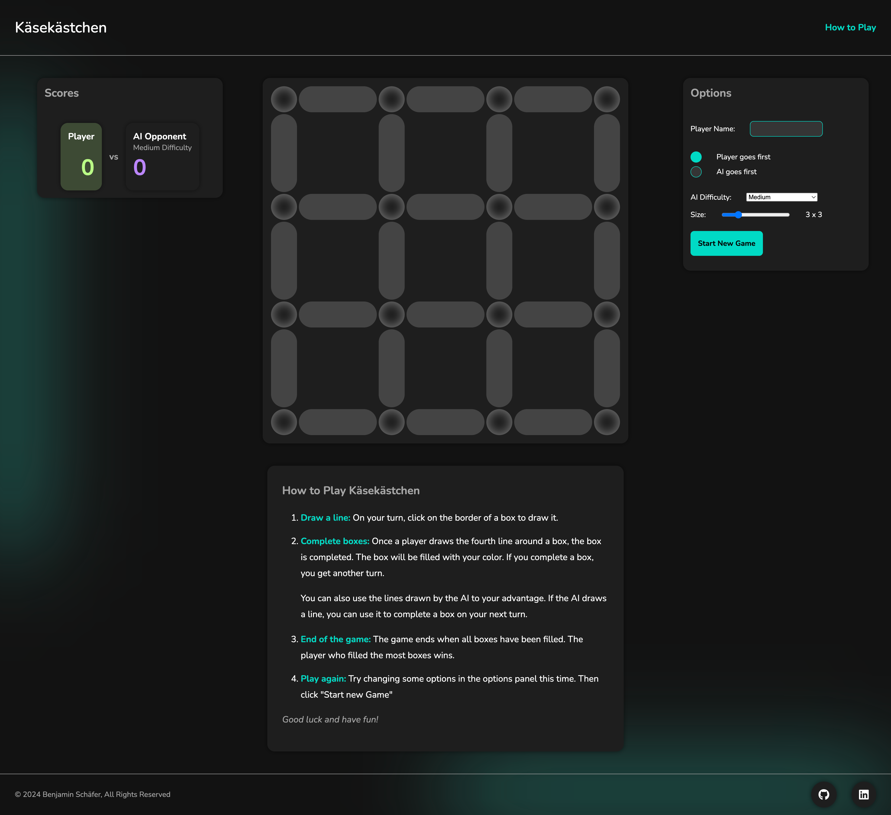
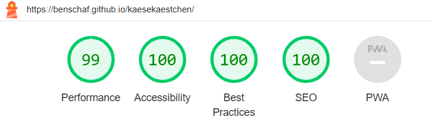
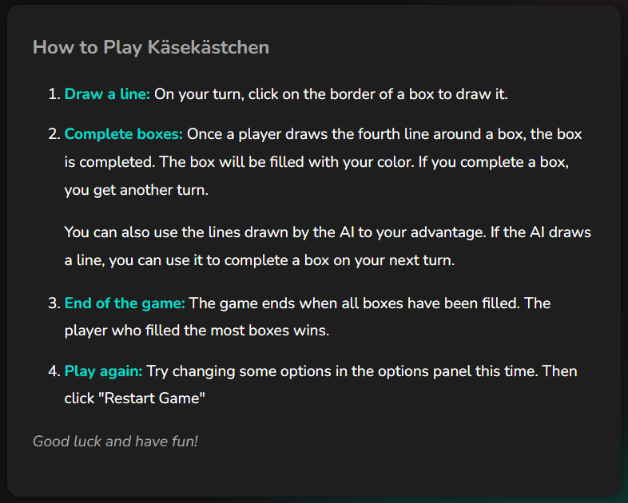

# Testing

Return back to the [README.md](README.md) file.

## Code Validation

### HTML

I have used the recommended [HTML W3C Validator](https://validator.w3.org) to validate all of my html file: index.html.

Click the badge above to validate the live deployed site.

Screenshot of the validation results:

### CSS

I have used the recommended [CSS Jigsaw Validator](https://jigsaw.w3.org/css-validator) to validate my css file: assets/css/style.css.

Click the badge above to validate the live deployed site.

Screenshot of the validation results:

### JavaScript

I have used the recommended [JShint Validator](https://jshint.com) to validate my Java Script file: assets/js/script.js.

Screenshot of the validation results:

!!! d Are these warnings acceptable?

## Browser Compatibility

I've tested my deployed project on multiple browsers to check for compatibility issues.

| Browser | Top Part Screenshot | Bottom Part Screenshot | Notes |
| --- | --- | --- | --- |
| Chrome |  |  | Works as expected |
| Firefox Developer Edition |  |  | Blur elements render differently - this issue is not very noticeable |
| Edge |  |  | Works as expected |
| Safari |  |  | Background Blur elements look different and render inconsistently on reloading the page - this issue is not very noticeable |

The biggest takeaway from the browser testing is that the background blur elements render differently on different browsers. This is not a big issue as it is not very noticeable.

## Responsiveness

I've tested my deployed project on multiple devices to check for responsiveness issues.

| Device | Top Part Screenshot | Full Page Screenshot | Notes |
| --- | --- | --- | --- |
| Mobile (DevTools: iPhone 12 Pro) |  |  | Works as expected |
| Tablet (DevTools: iPad Air) |  |  | Works as expected |
| Desktop (Device: Macbook Air M2) |  |  | Works as expected |
| Mobile (Device: Google Pixel 6)|  |  | Works as expected |

## Lighthouse Audit

I've tested my deployed project using the Lighthouse Audit tool to check for any major issues.

|Device| Notes | Screenshot |
| --- | --- | --- |
| Mobile | Layout shift warnings |  |
| Desktop | No warnings |  |

## Defensive Programming

Defensive programming was manually tested with the below user acceptance testing:

| Page | Expectation | Test | Result | Fix | Screenshot |
| --- | --- | --- | --- | --- | --- |
| **Header** | | | | | |
| | "How to Play" button is expected to scroll down to #instructions section. | Tested the feature by clicking on the "How to Play" button | The button behaved as expected, and it scrolled the page down to #instructions. | Test concluded and passed |  |
| **Game-Area** | | | | | |
| | Hovering the borders in the gameboard is expected to highlight the borders. | Tested the feature by hovering over the borders in the gameboard. | The borders were highlighted as expected. Upon mouseout the highlight disappears as expected | Test concluded and passed |  |
| | Clicking a border is expected to mark it as drawn by applying an inset shadow. The gray background color that was used to highlight the box should disappear. | Tested the feature by clicking on a border in the gameboard. | The border was marked as drawn with an inset shadow and the gray background color disappeared as expected. | Test concluded and passed |  |
| | Once a border is drawn, the AI is expected to draw a border. This is indicated by an "AI is playing" banner that appears. After one second the banner is expected to disappear and a new drawn border appears on the gameboard. | Tested the feature by clicking on a border in the gameboard. | The "AI is playing" banner appeared as expected. After one second the banner disappeared and a new drawn border appeared on the gameboard as expected. | Test concluded and passed | refer to above screencast |
| | Once 4 borders are drawn around a box, the box is expected to be marked as owned by the player who drew the last border. This is indicated by a colored background. | Tested the feature by clicking on a border in the gameboard. | The box was marked as owned by the player who drew the last border as expected. | Test concluded and passed | refer to above screencast |
| | Once a box is owned by a player, the player is expected to be given another turn to draw a border. | Tested the feature by completing a box. | The player was given another turn to draw a border as expected. | Test concluded and passed | refer to above screencast |
| | Once all boxes are owned, the game is expected to end. This is indicated by a banner that indicates, if the player won or lost. The banner should disappear after a short amount of time. | Tested the feature by completing all boxes. | The game ended as expected. The banner appeared and indicated that the player won. "You Lost" and "Tie" are also reachable results. The banner disappeared after some time passed. | Test concluded and passed | refer to above screencast | 
| | Clicking a border that is already drawn is expected to do nothing. | Tested the feature by clicking on a border that is already drawn. | The border did nothing as expected. | Test concluded and passed |  |
| | Completing a box is expected to draw a background blur element behind the gameboard. The colour of the element is expected to correspond to the colour of the player who completed the box. | Tested the feature by completing a box. | The background blur element appeared behind the gameboard as expected. The colour of the element corresponded to the colour of the player who completed the box as expected. | Test concluded and passed |  |
| **Scoreboard** | | | | | |
| | The scoreboard is expected to show the current score of the player and the AI. | Tested the feature by playing a game. | The scoreboard showed the current score of the player and the AI as expected. | Test concluded and passed |  |
| | The scoreboard is expected to indicate the current turn by displaying the active players background colour and by blinking for a second on the start of every turn. | Tested the feature by playing a game. | The scoreboard indicated the current turn by displaying the active players background colour and by blinking for a second on the start of every turn as expected. | Test concluded and passed | refer to above screencast |
| | The scoreboard is expected to display a message stating if the player won or lost the game. | Tested the feature by playing a game. | The scoreboard displayed a message stating if the player won or lost the game as expected. "You Lost" and "Tie" are also reachable messages. | Test concluded and passed | refer to above screencast |
| **Options Card** | | | | | |
| | The "Player Name" input field is expected to allow the player to enter their name. | Tested the feature by entering a name in the "Player Name" input field. | The input field allowed the entry of a name as expected. | Test concluded and passed |  |
| | The "Player goes first" and "AI goes first" radio buttons are expected to allow the player to choose who goes first. | Tested the feature by selecting each radio button. | The radio buttons allowed the selection of who goes first as expected. | Test concluded and passed | refer to above screencast |
| | The "AI Difficulty" dropdown is expected to allow the player to select the difficulty level of the AI. | Tested the feature by selecting each option in the dropdown. | The dropdown allowed the selection of the AI difficulty level as expected. | Test concluded and passed | refer to above screencast |
| | The "Size" range input is expected to allow the player to select the size of the game grid. | Tested the feature by moving the range input. | The range input allowed the selection of the game grid size as expected. | Test concluded and passed | refer to above screencast |
| | The "Start New Game" button is expected to start a new game with the selected options. | Tested the feature by clicking the "Start New Game" button. | The button started a new game with the selected options as expected. | Test concluded and passed | refer to above screencast |
| **Footer** | | | | | |
| | The GitHub and LinkedIn icons are expected to link to the correct profiles. The Profiles should open in a new page. | Tested the feature by clicking the GitHub and LinkedIn icons. | The icons linked to the correct profiles. The profiles opened in a new page as expected. | Test concluded and passed |  |

## User Story Testing

| User Story | Screenshot |
| --- | --- |
| As a User, I would like to play a fun game, so that I can spend some time. |  |
| As a User, I would like to play the game on different devices, so that I can play on my preferred device. |  |
| As a User, I would like to select the size of the grid, so that I can customize the game to my liking. |  |
| As a User, I would like to see the scores of both players, so that I can know who is winning. |  |
| As a User, I would like to change my player name, so that I can personalize my game experience. |  |
| As a User, I would like to choose who goes first in the game, so that I can strategize my game play. | refer to above screencast |
| As a User, I would like to select the AI difficulty level, so that I can adjust the game to my skill level. | refer to above screencast |
| As a User, I would like to adjust the size of the grid, so that I can control the complexity of the game. | refer to above screencast |
| As a User, I would like to restart the game, so that I can play again. | refer to above screencast |
| As a User, I would like to read the game instructions, so that I can understand how to play the game. |  |

## Bugs

🛑🛑🛑🛑🛑 START OF NOTES (to be deleted) 🛑🛑🛑🛑🛑

This section is primarily used for JavaScript and Python applications,
but feel free to use this section to document any HTML/CSS bugs you might run into.

It's very important to document any bugs you've discovered while developing the project.
Make sure to include any necessary steps you've implemented to fix the bug(s) as well.

**PRO TIP**: screenshots of bugs are extremely helpful, and go a long way!

🛑🛑🛑🛑🛑 END OF NOTES (to be deleted) 🛑🛑🛑🛑🛑

- JS Uncaught ReferenceError: `foobar` is undefined/not defined

    

    - To fix this, I _____________________.

- JS `'let'` or `'const'` or `'template literal syntax'` or `'arrow function syntax (=>)'` is available in ES6 (use `'esversion: 11'`) or Mozilla JS extensions (use moz).

    

    - To fix this, I _____________________.

- Python `'ModuleNotFoundError'` when trying to import module from imported package

    

    - To fix this, I _____________________.

- Django `TemplateDoesNotExist` at /appname/path appname/template_name.html

    

    - To fix this, I _____________________.

- Python `E501 line too long` (93 > 79 characters)

    

    - To fix this, I _____________________.

## Unfixed Bugs

🛑🛑🛑🛑🛑 START OF NOTES (to be deleted) 🛑🛑🛑🛑🛑

You will need to mention unfixed bugs and why they were not fixed.
This section should include shortcomings of the frameworks or technologies used.
Although time can be a big variable to consider, paucity of time and difficulty understanding
implementation is not a valid reason to leave bugs unfixed.

If you've identified any unfixed bugs, no matter how small, be sure to list them here.
It's better to be honest and list them, because if it's not documented and an assessor finds the issue,
they need to know whether or not you're aware of them as well, and why you've not corrected/fixed them.

Some examples:

🛑🛑🛑🛑🛑 END OF NOTES (to be deleted) 🛑🛑🛑🛑🛑

- On devices smaller than 375px, the page starts to have `overflow-x` scrolling.

    

    - Attempted fix: I tried to add additional media queries to handle this, but things started becoming too small to read.

- For PP3, when using a helper `clear()` function, any text above the height of the terminal does not clear, and remains when you scroll up.

    

    - Attempted fix: I tried to adjust the terminal size, but it only resizes the actual terminal, not the allowable area for text.

- When validating HTML with a semantic `section` element, the validator warns about lacking a header `h2-h6`. This is acceptable.

    

    - Attempted fix: this is a known warning and acceptable, and my section doesn't require a header since it's dynamically added via JS.

🛑🛑🛑🛑🛑 START OF NOTES (to be deleted) 🛑🛑🛑🛑🛑

If you legitimately cannot find any unfixed bugs or warnings, then use the following sentence:

🛑🛑🛑🛑🛑 END OF NOTES (to be deleted) 🛑🛑🛑🛑🛑

There are no remaining bugs that I am aware of.
